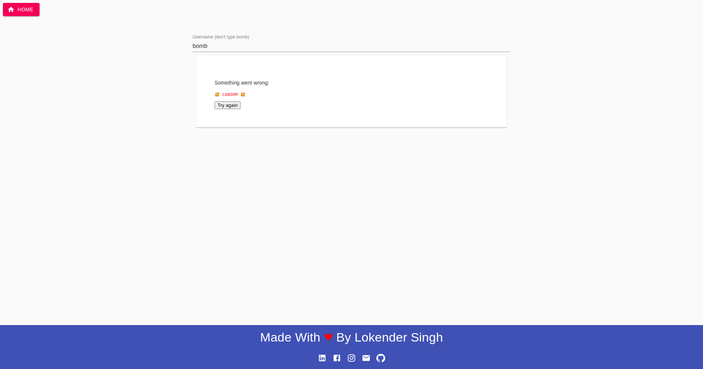
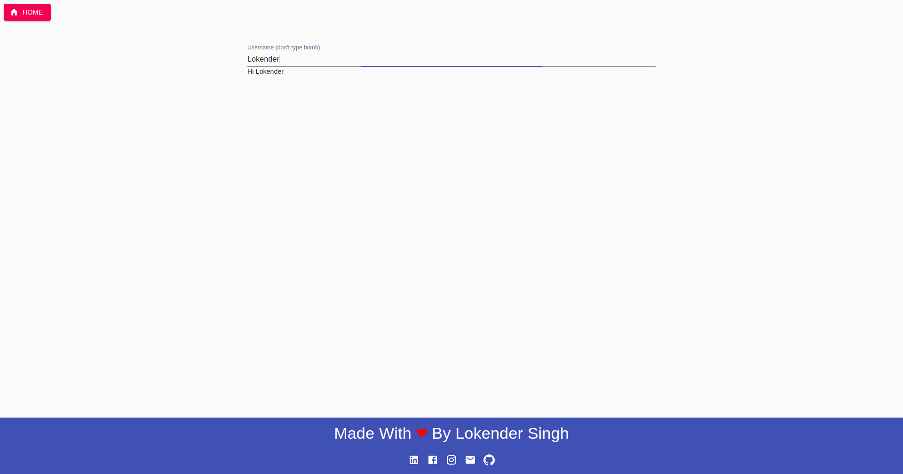

# Simple_MERN_Short_Demo_ErrorBoundaries

It's a simple example or demo project to show Error Boundaries usage
it's made by using following technologies

- ReactJS
- MaterialUI

## How To Run

```
- Client

    1. Move To Client Directory
    cd Client/

    2. Install Packages
    yarn

    3. start App
    yarn start
```

## Tasks Completed

1. Homepage
2. Basic Error Boundary

## Demo ScreenShots

- Error Occurred
  

- No Error Occurred
  
